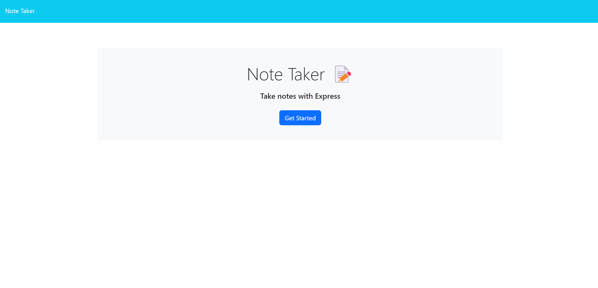
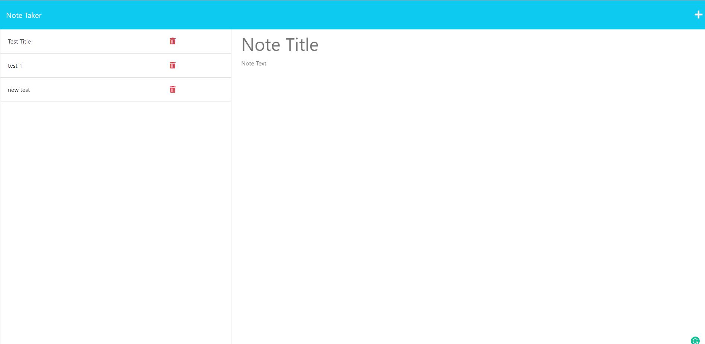

# Note Taker []

  ## Description
  
  This application is a note-taker app that allows a user to title a note and write basic body text to it. Upon opening the app, the user is presented with a basic page with a button to enter the note taking application. If a user inputs an otherwised undefined endpoing, they will be rerouted to this page. This page should look like the screenshot: 
  
  The notes page is where a user will be able to enter note information. This app uses an external database to store these notes, and uses API routes to allow a user to fetch a previously written note, save notes, and to delete a note. If working properly, All previously-written notes should appear on the right-hand column, and new notes or a requested, previously written note will be dispalyed on the left side, for a user to either add text or to read it. This page should look like the following screenshot: 

  This application uses Heroku for deployment.
  
  This application allowed me as a developer to practice writing server-side code using express, and to understand the back-end of fetch-requests. 

  ---
  ## Table of Contents 

  - [Installation](#instlalation)
  - [Usage](#usage)
  - [License](#license) 
  - [Contributing](#contributing)
  - [Test](#test)
  - [Questions](#questions)
  ---

  ## Installation

  For functional use, there are no installation requirements. To see this note in action, please go to [this link](https://warm-stream-07044.herokuapp.com/). The user should be presented with the home page

  For developmental use, upon cloning the repo, a developer should be sure to enter the command 'npm i' in the root of the directory to install npm packages express and uuid. 

  ## Usage 

  For functional use, upon entering the /notes route, a user just needs to either write new notes by clicking the + button and saving it with the save icon, read old notes by clicking the note title in the left column, or deleting old notes with the trash can icon. 

  ## License

  [License: MIT](https://opensource.org/licenses/MIT)

  Copyright 2023 Anna Langford
  
  Permission is hereby granted, free of charge, to any person obtaining a copy of this software and associated documentation files (the "Software"), to deal in the Software without restriction, including without limitation the rights to use, copy, modify, merge, publish, distribute, sublicense, and/or sell copies of the Software, and to permit persons to whom the Software is furnished to do so, subject to the following conditions:
  
  The above copyright notice and this permission notice shall be included in all copies or substantial portions of the Software.
  
  THE SOFTWARE IS PROVIDED "AS IS", WITHOUT WARRANTY OF ANY KIND, EXPRESS OR IMPLIED, INCLUDING BUT NOT LIMITED TO THE WARRANTIES OF MERCHANTABILITY, FITNESS FOR A PARTICULAR PURPOSE AND NONINFRINGEMENT. IN NO EVENT SHALL THE AUTHORS OR COPYRIGHT HOLDERS BE LIABLE FOR ANY CLAIM, DAMAGES OR OTHER LIABILITY, WHETHER IN AN ACTION OF CONTRACT, TORT OR OTHERWISE, ARISING FROM, OUT OF OR IN CONNECTION WITH THE SOFTWARE OR THE USE OR OTHER DEALINGS IN THE SOFTWARE.

  ## Contributing

    No other developers were consulted with this application. 

    MDN's page for [.filter()](https://developer.mozilla.org/en-US/docs/Web/JavaScript/Reference/Global_Objects/Array/filter) and the Expressjs docs for [app.delete()](http://expressjs.com/en/5x/api.html#app.delete.method) were heavily consulted for the app.delete() route.

  ## Test

  This app does not have any additional tests. If there are future tests, developers should update the (installation)[#installation] section

  ## Questions

  If there are any persisting questions, please contact me at annacl1822@gmail.com. If you would like to look at my other projects, please look at my GitHub account at [Anna-dxj](https://github.com/Anna-dxj).  
